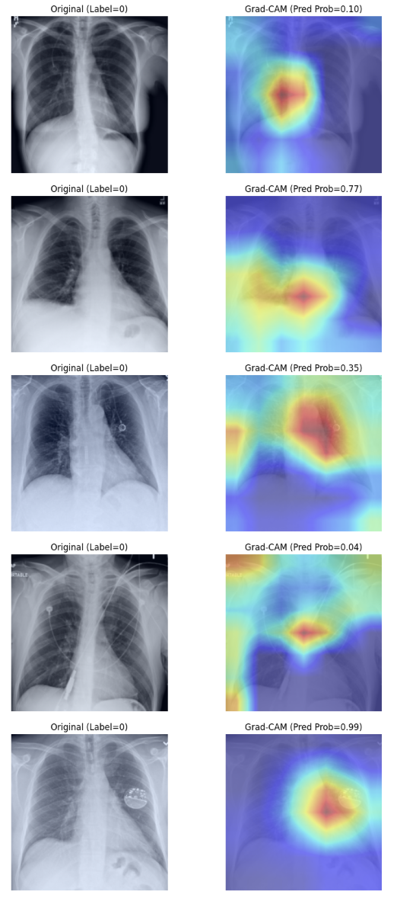

# Resneton NIH dataset results
Final VAL loss: 0.9085, acc@0.5: 0.644
Best VAL threshold: 0.10 | F1: 0.693 | Acc: 0.601

Test loss: 0.9773, Test acc@0.5: 0.640

[Threshold = 0.5] Confusion matrix (rows=true, cols=pred):
[[250 171]
 [120 267]]

[Threshold = 0.5] Classification report:
              precision    recall  f1-score   support

  No Finding       0.68      0.59      0.63       421
 Any Finding       0.61      0.69      0.65       387

    accuracy                           0.64       808
   macro avg       0.64      0.64      0.64       808
weighted avg       0.64      0.64      0.64       808

ROC-AUC: 0.6725

[Threshold = 0.10] Test acc: 0.571, F1: 0.669
[Threshold = 0.10] Confusion matrix (rows=true, cols=pred):
[[110 311]
 [ 36 351]]

[Threshold = 0.10] Classification report:
              precision    recall  f1-score   support

  No Finding       0.75      0.26      0.39       421
 Any Finding       0.53      0.91      0.67       387

    accuracy                           0.57       808
   macro avg       0.64      0.58      0.53       808
weighted avg       0.65      0.57      0.52       808

===== Subgroup Performance by Gender =====

Gender: F
  Count: 365
  Accuracy: 0.674
  F1 Score: 0.699
  ROC-AUC: 0.699

Gender: M
  Count: 443
  Accuracy: 0.612
  F1 Score: 0.600
  ROC-AUC: 0.649

===== Subgroup Performance by Age =====

Age Group: 0-20
  Count: 52
  Accuracy: 0.519
  F1 Score: 0.419
  ROC-AUC: 0.533

Age Group: 21-40
  Count: 216
  Accuracy: 0.676
  F1 Score: 0.657
  ROC-AUC: 0.719

Age Group: 41-60
  Count: 352
  Accuracy: 0.648
  F1 Score: 0.659
  ROC-AUC: 0.678

Age Group: 61-80
  Count: 185
  Accuracy: 0.611
  F1 Score: 0.654
  ROC-AUC: 0.644

# Heat Maps

